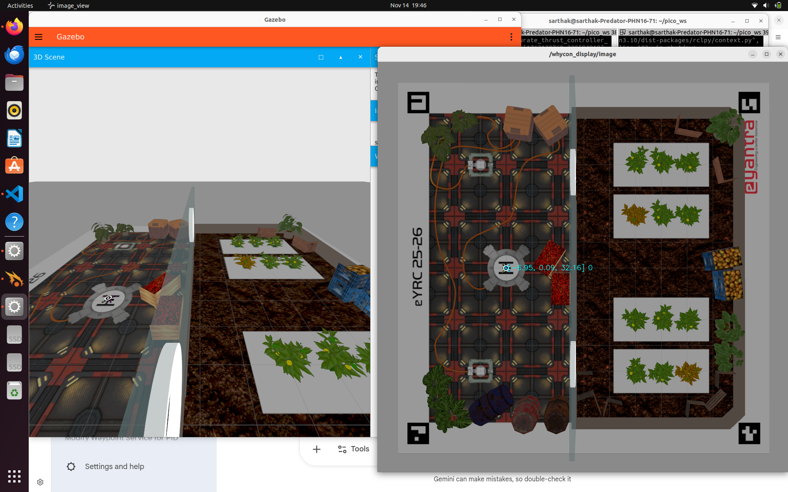
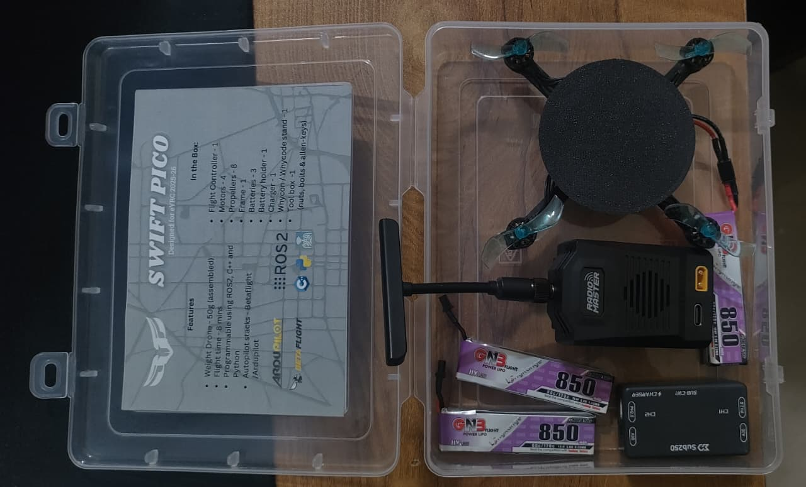

# 🚀 Autonomous Drone Project – e-Yantra Competition (IIT Bombay)

## 🏆 Overview

This project was developed as part of the prestigious **e-Yantra Robotics Competition (eYRC)** conducted by IIT Bombay.

Our team successfully advanced to the **Top 50 teams nationwide**, which earned us a **free autonomous drone hardware kit** from IIT Bombay.

We designed and worked on an **autonomous drone system** capable of performing tasks with minimal human intervention.

---

## 🥇 Achievements

* 🏆 Selected among **Top 50 teams** across India
* 🎯 Successfully cleared **5 competitive stages** of the competition
* 📦 Received **free hardware kit (Autonomous Drone)** from IIT Bombay
* 🤝 Worked in a team-based robotics development environment

---

## 🤖 About e-Yantra

e-Yantra is a robotics outreach program by IIT Bombay that focuses on embedded systems and real-world problem solving using robotics.

The competition involves:

* Multi-stage evaluation
* Problem-solving using robotics
* Simulation + hardware implementation

---

About the Project KRISHI DRONE 

🌾 Theme: Krishi Drone (KD) – Sustainable Smart Farming

This project addresses the future of sustainable agriculture through robotics and automation. Designed for a compact smart greenhouse, our system operates a "Krishi Drone" to autonomously monitor and treat crops. Because the drone itself carries no onboard camera, we engineered a centralized control system that relies on an overhead camera to act as the "eyes" of the operation.

The system uses Image Processing to continuously scan the crop beds below for signs of disease, such as yellowing leaves or mildew. Once a problem is detected, our ground computer calculates the coordinates and guides the drone to navigate through brightly colored hoops, pick up a targeted pesticide treatment, and precisely spray the infected zone. This highly targeted approach avoids waste, protects nearby healthy crops, and promotes a cleaner, resource-efficient farming ecosystem.

To bring this complex system to life, our team mastered and integrated a diverse technical stack, including Linux Basics, ROS 2 & Gazebo simulations, Control Systems (PID) for quadcopter stability, and Git/GitHub for seamless collaboration.

---

## ✈️ Project Description

We worked on building and understanding an **Autonomous Drone System**, which involved:
    1710#1_KD_1710_task_3a.zip
    1710#2_KD_1710_task_3c.zip
    README.md
    task4a.py[RAW]
    task4b(pico_controller_PID.py) RAW

* 📡 Sensor-based navigation
* 🧠 Autonomous decision making
* ⚙️ Hardware integration and testing
* 🛰️ Real-world task execution

---

## 🧰 Tech & Concepts Used

* Linux
* ROS2
* Drone Control Systems
* Sensors & Actuators
* Gazebo
* Basic Robotics Algorithms
* Simulation & Testing

---

## 📸 Project Highlights

---

## 🎥 Simulation Demo (Gazebo)

This video demonstrates the **simulation of our autonomous drone system in Gazebo**.
The core of this system is a **PID controller implemented in Python**, which dynamically adjusts the drone’s movement by controlling parameters such as **thrust, throttle, yaw, and pitch**.
We defined specific **target coordinates in the code**, and the drone continuously adjusts its position to reach and stabilize at those points.
This was one of the **most challenging parts of the project**, as achieving accurate behavior in simulation requires a deep understanding and fine-tuning of:

* **P (Proportional)** – immediate response to error
* **I (Integral)** – accumulated error correction
* **D (Derivative)** – prediction and damping of motion

Tuning these parameters correctly was crucial to ensure that the drone behaved in a stable and controlled manner.

[[watch the video]:
https://youtu.be/qx7hLjOTvYE

---

## 🎥 Top Camera View & Coordinate Processing

This video showcases the **top camera (overhead) view of the simulation**, which plays a crucial role in providing positional feedback to the drone.

To ensure safety during testing, we **physically constrained the drone using strings**. This was necessary because, at times, the drone could drift out of the camera frame or move unpredictably, increasing the risk of collisions and potential damage. The strings allowed us to maintain control over its motion while still observing its behavior.

The camera captures the environment from above, and based on this visual input, we extract the **coordinates required for navigation**. These coordinates are then used by our **Python-based control system**, which continuously updates the drone’s movement.

We recorded this output directly from the system screen while running the Python script, demonstrating how the drone responds in real time to the incoming coordinate data.

This highlights the **integration between visual input and control logic**, where the drone dynamically adjusts its position according to the processed coordinates.

---

[[Watch the video]:
https://youtu.be/TyzEd0tCLXA

> 📌 This video demonstrates how the drone uses top-view camera input to determine coordinates and navigate while being safely constrained during testing.

---

### 📦 Hardware Kit Received

### 🛠️ Setup & Development

### 🎯 Work & Progress

### Hardware KIt Photo 

---

## 🚀 Learning Outcomes

* Hands-on experience with **autonomous systems**
* Understanding of **real-world robotics challenges**
* Improved **team collaboration & problem-solving skills**
* Exposure to **IIT-level competition environment**

---

## 📌 Conclusion

This project was a major milestone in our journey into robotics .
Participating in e-Yantra helped us gain practical experience and confidence in building real-world engineering solutions.

---

## 📬 Connect

If you liked this project or want to collaborate, feel free to connect!   [sarthakbenodkar@gmail.com]
My teammates :  1. Ameya Degaonkar 
                2. Aditya Dengale
                3. Pranav Rokade
